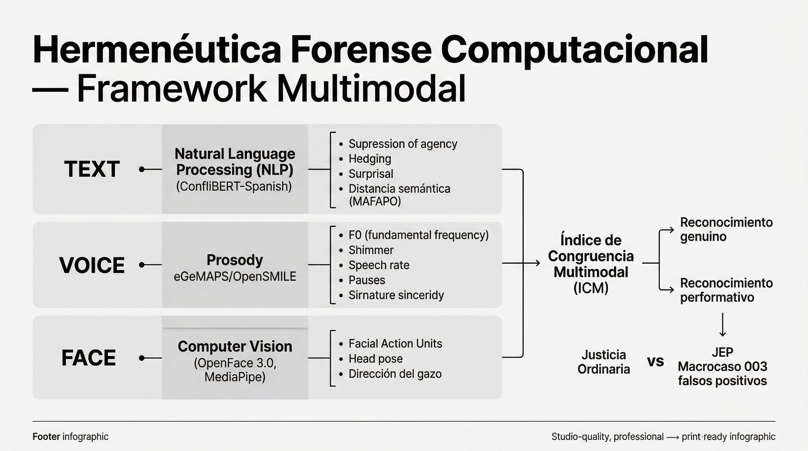

# Guía de Dirección Técnica

## Tesis Doctoral: Hermenéutica Forense Computacional

**Tesista:** Mireya Camacho Celis — Dra. en Derecho, Profesora UNAL
**Director técnico:** Julián Zuluaga — Orbital Lab / Universidad Externado
**Fecha:** Abril 2026

---

## 1. Pregunta central

> **¿La justicia transicional colombiana (JEP) repara la violencia discursiva de la justicia ordinaria frente a las víctimas de falsos positivos, o la reproduce?**

Cuando el Estado pasó de juzgar falsos positivos en justicia ordinaria (2002–2008) a procesarlos en la JEP (Macrocaso 003), **¿cambió realmente el lenguaje?** ¿Se acercó a la voz de las víctimas o reprodujo los mismos patrones de eufemismo, supresión de agentividad y negación?

### Subpreguntas

1. ¿Hay más violencia discursiva en justicia ordinaria que en JEP?
2. ¿El discurso JEP se acerca a la voz de las víctimas (polo MAFAPO/CIDH)?
3. ¿Qué dimensiones del discurso cambian y cuáles persisten?
4. ¿El reconocimiento en audiencias JEP es genuino o performativo?

<figure class="hero-image">

<figcaption>Arquitectura del Framework de Hermenéutica Forense Computacional — 3 capas convergen en el Índice de Congruencia Multimodal (ICM)</figcaption>
</figure>

---

## 2. Marco teórico (fortalezas actuales)

La triangulación filosófica del proyecto es sólida y bien articulada:

| Autor | Concepto | Rol en el framework |
|-------|----------|---------------------|
| **Habermas** (1981/1987) | Colonización sistémica del lenguaje | Cómo el aparato judicial coloniza el discurso sobre víctimas |
| **Fraser** (1995, 2008) | Paridad participativa, reconocimiento | ¿Las víctimas son reconocidas discursivamente? |
| **Galtung** (1969, 1990) | Violencia cultural | Los eufemismos militares como violencia simbólica |
| **Zehr** (2002) | Justicia restaurativa | Lo que la JEP debería lograr |

**Polo normativo:** MAFAPO (Madres de Falsos Positivos) + CIDH como referente semántico de la "voz de las víctimas".

---

## 3. Corpus disponible

| Corpus | Fuente | Tamaño | Estado |
|--------|--------|--------|--------|
| **A** | Justicia Ordinaria (2002–2008) | 819 secciones | ✅ Robusto |
| **B** | JEP escrita — Macrocaso 003 | 54 secciones | ⚠️ Ampliar (objetivo ≥200) |
| **C** | Audiencias JEP (video/audio) | 5 audiencias, 45.9h | ⚠️ Requiere diarización |

### Acciones sobre el corpus

- **Corpus B:** Descargar más autos del Macrocaso 003 (documentos públicos en JEP)
- **Corpus C:** Aplicar diarización con WhisperX/pyannote para identificar roles (compareciente, magistrado, víctima, abogado)
- **Segmentación temporal:** Dividir videos en ventanas de 3–5 segundos → convierte 5 videos en ~50–100 segmentos para análisis estadístico

---

## 4. Arquitectura propuesta: 3 capas + ICM

### Capa 1 — Léxica: "¿Cambian las palabras?"

Análisis sobre Corpus A y B con indicadores existentes y nuevos.

**Features existentes (validados):**

| Indicador | Qué mide | Estado |
|-----------|----------|--------|
| SA — Supresión de agentividad | Voz pasiva, omisión del agente | ✅ Implementado |
| NV — Negación de victimización | Minimización, negación | ✅ Implementado |
| REP — Léxico de reparación | Palabras de reconocimiento, perdón | ✅ F1=0.77 |
| CivDist — Distancia léxico civil | Lenguaje militar vs civil | ✅ Implementado |

**Features nuevos (por implementar):**

| Feature | Qué mide | Herramienta |
|---------|----------|-------------|
| **Persona gramatical** | "Yo maté" vs "Se produjo la baja" — accountability | spaCy POS, LIWC-22 |
| **Hedging** | "Tal vez", "en cierta medida" — evasión | Diccionario + dependency parsing |
| **Léxico emocional** | Carga emocional del discurso | NRC Emotion + pysentimiento |
| **Surprisal** | Eufemismos normalizados tienen bajo surprisal | BETO/GPT-2 log-probabilidades |
| **Encuadre narrativo** | Auto-centramiento vs víctima-centramiento | NER + conteo de menciones |

**Método:** Tests robustos A vs B — Mann-Whitney, permutation, bootstrap, effect size (Cohen's d).

### Capa 2 — Semántica: "¿Cambia el significado?"

Análisis con embeddings de ConfliBERT-Spanish.

| Análisis | Método | Output |
|----------|--------|--------|
| Distancia al polo MAFAPO/CIDH | Cosine similarity por sección | ¿B está más cerca que A? |
| Convergencia temporal | Evolución de distancia a lo largo del tiempo | ¿La JEP se acerca a víctimas? |
| Clusters por corpus | t-SNE/UMAP de embeddings | Visualización de separación |
| Surprisal diferencial | Comparar surprisal del mismo término en A vs B | ¿La JEP desautomatizó el eufemismo? |

**Hallazgo actual:** y8 (distancia MAFAPO, p=0.0004) e y9 (distancia CIDH, p<0.001) son significativos entre Corpus A y B, incluso controlando periodo temporal. Esto valida que ConfliBERT captura algo más profundo que diferencias léxicas superficiales.

### Capa 3 — Multimodal: "¿Es genuino?"

Solo sobre Corpus C (audiencias JEP en video). La contribución más original.

**3a. Prosodia (voz):**

| Feature | Qué indica | Evidencia científica |
|---------|------------|---------------------|
| Alpha ratio | Estrés involuntario | PLOS ONE 2025: marcador más confiable |
| Shimmer | Tensión vocal | Más confiable que jitter (2025) |
| F0 + volumen + tempo | Firma de sinceridad | SinA-C: 79.2% UAR (Baird 2019) |
| Pausas largas | Procesamiento difícil / recall incorrecto | J. Nonverbal Behavior 2024 |
| Speech rate baja | Engaño / carga cognitiva | Levitan et al. 2020, TACL |

Herramienta: **OpenSMILE** (eGeMAPS, 88 parámetros) — estándar vigente 2025.

**3b. Computer Vision (rostro):**

| Feature | Qué indica | Evidencia científica |
|---------|------------|---------------------|
| AU4 (Brow Lowerer) | Frowning — marcador de culpa | Nature Scientific Reports 2024 |
| AU6+12 vs AU12 solo | Sonrisa genuina vs social | Duchenne marker |
| AU1+AU15+AU17 | Distress, tristeza, contención | FACS estándar |
| Head pitch (abajo) | Vergüenza | MediaPipe |
| Head yaw (girar) | Evitación | MediaPipe |
| Gaze direction | ¿Mira a las víctimas? | OpenFace 3.0 |

Herramientas: **OpenFace 3.0** (junio 2025, SOTA) + **MediaPipe**.

**Hallazgo clave de la literatura:** La culpa NO tiene un display facial discreto identificable (Nature 2024). Esto refuerza que el enfoque correcto no es buscar AUs individuales de remordimiento, sino medir **congruencia entre canales**.

---

## 5. El Índice de Congruencia Multimodal (ICM)

La contribución doctoral central. Operacionaliza cuantitativamente el concepto de **reconocimiento** de Nancy Fraser.

### Reconocimiento genuino (ICM alto — congruente)

**Verbal:** "Yo... [pausa]... le quité la vida a su hijo" — 1ª persona, agente explícito, léxico de reparación

**Vocal:** Quiebre en voz (shimmer alto), pausas largas, baja intensidad

**Facial:** AU1+AU4 (distress), AU15 (tristeza), AU17 (contención), cabeza baja

### Reconocimiento performativo (ICM bajo — incongruente)

**Verbal:** "Reconozco mi responsabilidad" — REP alto, pero sin SA bajo

**Vocal:** Monotonía, sin pausas, speech rate constante

**Facial:** Sin AU1 (no distress), AU12 sin AU6 (sonrisa social), cabeza erguida

### Métricas de congruencia

| Métrica | Cómo funciona | Cuándo usar |
|---------|---------------|-------------|
| Desviación estándar emocional entre canales | Valencia/arousal por modalidad en ventanas de 10s; alta std dev = incongruencia | Simple, no requiere entrenamiento |
| Cosine similarity entre embeddings modales | BERT (texto) vs HuBERT (audio) vs CLIP (video) | Transfer learning |
| Correlación inter-modal (Pearson) | Correlación entre series de valencia texto vs audio vs video | Más interpretable |

---

## 6. SEM re-especificado

El modelo original de 4 factores latentes y 12 indicadores no ajusta (CFI=0.619, RMSEA=0.437). Se propone un modelo simplificado que sí es estimable con los datos disponibles:

| Variable | Tipo | Indicadores |
|----------|------|-------------|
| **ξ₁ Violencia Discursiva** | Exógena (texto) | SA, NV, CivDist |
| **ξ₂ Afecto Expresado** | Exógena (voz+rostro) | eGeMAPS composite, AU distress, head pitch |
| **η₁ Congruencia** | Endógena | f(ξ₁, ξ₂) — alineación verbal/no-verbal |
| **y₈ Distancia MAFAPO** | Resultado | Cosine similarity al polo víctimas |

**Enfoque estadístico:** PLS-SEM (viable con N<50 segmentos) o Bayesian SEM con priors informativos.

**Estrategia N:** Segmentación de 5 videos en ventanas de 3–5 segundos → ~50–100 observaciones.

---

## 7. Brecha doctoral confirmada

Se realizó búsqueda exhaustiva en la literatura científica (2024–2026). **Nadie ha hecho lo siguiente:**

| Brecha | Estado en la literatura |
|--------|------------------------|
| NLP + prosodia + CV en audiencias de justicia transicional LatAm | **Sin precedentes** |
| SEM con indicadores computacionales multimodales para violencia discursiva | **Sin precedentes** |
| Operacionalizar reconocimiento de Fraser con métodos computacionales | **Sin precedentes** |
| Índice de congruencia verbal/no-verbal en testimonios de perpetradores | **Sin precedentes** |
| ConfliBERT en discurso judicial colombiano | Solo Gutiérrez-Osorio et al. (2025), textual |

**Las piezas existen** (LegalEye, SinA-C, OpenFace, eGeMAPS, ConfliBERT) **pero nadie las ha integrado para justicia transicional.** La contribución es genuinamente original.

---

## 8. Prerrequisitos técnicos

Antes de implementar las 3 capas:

| # | Tarea | Prioridad | Esfuerzo |
|---|-------|-----------|----------|
| 1 | Diarización Corpus C (WhisperX/pyannote) | Alta | ~8h |
| 2 | Ampliar Corpus B — más autos JEP Macrocaso 003 | Alta | ~6h |
| 3 | Segundo anotador IAA (mín. 30 textos, kappa por clase) | Alta | ~4h |
| 4 | Eliminar Titans del título (no implementable) | Media | 0h |
| 5 | Hacer repo reproducible (pyproject.toml, datos de muestra) | Media | ~4h |

---

## 9. Hitos sugeridos

| Fase | Entregable | Dependencias |
|------|------------|--------------|
| **F0** | Prerrequisitos: diarización, ampliar Corpus B, IAA | — |
| **F1** | Capa 1 completa: tests léxicos A vs B con features nuevos | F0 |
| **F2** | Capa 2 completa: embedding space, MAFAPO, UMAP, surprisal | F1 |
| **F3** | Capa 3: extracción eGeMAPS + AUs + head pose sobre Corpus C | F0 (diarización) |
| **F4** | Integración: ICM + SEM re-especificado | F1 + F2 + F3 |
| **F5** | Redacción de tesis | F4 |

---

## 10. Bibliografía sugerida — por orden de importancia

### Prioridad 1 — Debe citar obligatoriamente

**1. Gutiérrez-Osorio, C. et al. (2025).** *"Construyendo la verdad: minería de texto y redes lingüísticas en audiencias públicas del Caso 03 de la JEP."* arXiv:2504.04325.
**ÚNICO paper que aplica NLP directamente a audiencias del Macrocaso 003.** Usa minería de texto, análisis de sentimiento y redes semánticas skipgram. Identifica clusters temáticos que revelan diferencias regionales y de estatus procesal. No citarlo sería un vacío imperdonable.

**2. Baldivas, S., Sreenivasan, A. et al. (2025).** *"LegalEye: Multimodal Court Deception Detection Across Multiple Languages."* Behavioral Sciences, MDPI.
**Demuestra viabilidad del análisis multimodal en español en juicios reales.** Arquitectura FAUs + MFCCs + léxico con fusión tardía. 97% accuracy inglés, 85% español. La modalidad visual domina en inglés pero la acústica en español — hallazgo directamente relevante para la tesis.

**3. Pérez-Rosas, V., Abouelenien, M., Mihalcea, R. et al. (2015).** *"Verbal and Nonverbal Clues for Real-life Deception Detection."* EMNLP 2015.
**Dataset fundacional "Real-life Trial"** usado por múltiples estudios posteriores. Features verbales + 9 grupos no-verbales. 60–75% precisión multimodal, superando a humanos. Establece la línea base del campo.

### Prioridad 2 — Prosodia y sinceridad

**4. Baird, A. & Coutinho, E. (2019).** *"Sincerity in Acted Speech: The Sincere Apology Corpus (SinA-C)."* INTERSPEECH 2019.
912 audios de disculpas, 22 jueces anotadores. 79.2% UAR en clasificación sincero/no-sincero con features prosódicas. **Directamente aplicable a medir sinceridad de actos de reconocimiento.** Pitch inicial alto + volumen bajo + tempo rápido = percepción de sinceridad.

**5. Loy, J., Rohde, H. & Corley, M. (2017).** *"Listeners' perceptions of certainty and honesty are associated with a common prosodic signature."* Nature Communications.
**Demuestra que existe una firma prosódica cross-lingüística de honestidad.** Independiente del idioma/dialecto. Base teórica para que features prosódicos sean indicadores válidos de sinceridad en testimonios de cualquier hablante.

**6. Levitan, S. et al. (2020).** *"Acoustic-Prosodic and Lexical Cues to Deception and Trust."* TACL, MIT Press.
Speech rate disminuye en respuestas engañosas; cambios de pitch correlacionan con estrés psicológico. **Features operacionalizables para medir incongruencia entre discurso verbal y estado emocional.**

### Prioridad 3 — Computer Vision y expresión no-verbal

**7. Scientific Reports (2024).** *"The nonverbal expression of guilt in healthy adults."* Nature, vol. 14, art. 10607.
**Hallazgo disruptivo:** la culpa NO tiene un display facial discreto identificable. Frowning (AU4) y neck touching son los más asociados. La falla en expresar culpa no-verbalmente → percepciones de insinceridad. **Fundamenta el ICM:** no buscar AUs aisladas sino congruencia multicanal.

**8. Psychology, Crime & Law (2025).** *"The emotional defendant effect: a systematic review."* Taylor & Francis.
Expresar emoción beneficia al acusado en sentencia. Percepciones de remordimiento son poderosas en decisiones judiciales. Confirma que **medir remordimiento computacionalmente tiene valor directo** para el sistema de justicia.

**9. OpenFace 3.0 (Baltrusaitis et al., 2025).** *"A Lightweight Multitask System for Comprehensive Facial Behavior Analysis."* arXiv:2506.02891.
Versión más reciente (junio 2025), 29.4M parámetros, más rápido y preciso que 2.0. **Herramienta recomendada para extracción de AUs.**

### Prioridad 4 — NLP y análisis discursivo

**10. Cann, T. et al. (2025).** *"Semantic Echo."* EPJ Data Science, Springer.
Propone medir el "eco semántico" de comunicaciones estratégicas usando cosine similarity de embeddings. Mide si la distancia a un corpus de referencia disminuye a lo largo del tiempo. **Metodología directamente aplicable** para medir convergencia discurso judicial → voz de víctimas.

**11. Yang, W. et al. (2023).** *"ConfliBERT-Spanish."* IEEE CiSt 2023, pp. 287–292.
BERT pre-entrenado en conflicto político en español, 123 sitios de noticias de 18 países. F1=89.6 en clasificación binaria. **Motor NLP central de la tesis.** Ya implementado parcialmente en el repo.

**12. Shain, C. et al. (2024).** *"Surprisal theory in 11 languages."* TACL.
Valida correlaciones surprisal–procesamiento cognitivo en 11 idiomas incluyendo español. **Fundamenta el uso de surprisal** para detectar eufemismos normalizados en discurso judicial.

### Prioridad 5 — Marcos conceptuales y fusión

**13. Meyers, J. & Valls-Vargas, J. (2023).** *"The Language of Inclusion: Critical Corpus-Based Methods in Liberia's Truth Commission."* Social Justice Research, Springer.
Análisis computacional de corpus en comisión de verdad de Liberia. **Precedente directo** para análisis de justicia transicional con métodos NLP.

**14. Impunity Watch (2025).** *"AI and Transitional Justice: Mapping Report."*
Mapeo sistemático de herramientas computacionales usadas en justicia transicional. OSINT, NLP, OCR, análisis espacial, reconstrucción digital. Incluye discusión ética sobre sesgos algorítmicos.

**15. Zheng et al. (2025).** *"Meaning transformation: from multimodal courtroom discourse to legal judgments."* Nature Humanities & Social Sciences Communications.
Semiótica multimodal en alegatos finales. La persuasión jurídica resulta de la combinación de modos semióticos. **Marco teórico para operacionalizar violencia discursiva como fenómeno multimodal.**

### Prioridad 6 — Metodología y herramientas

**16. Zhu, J. et al. (2023).** *"Personal vs. Linguistic Agency."* Communications Psychology.
Medición computacional de agencia lingüística vía extracción SVO. Ratio voz activa/pasiva, nominalizaciones, fuerza modal. **Directamente implementable** para medir supresión de agentividad.

**17. Eyben, F. et al. (2016).** *"The Geneva Minimalistic Acoustic Parameter Set (eGeMAPS)."* IEEE T-AFFC.
88 features acústicas estandarizadas. 86.2% AUC en reconocimiento emocional clínico. **Herramienta de referencia** para extracción prosódica.

**18. Hu, Y. et al. (2022).** *"ConfliBERT: A Pre-trained Language Model for Political Conflict and Violence."* NAACL 2022.
Modelo base (inglés) pre-entrenado en 33 GB de texto sobre conflicto político. Supera modelos mayores en clasificación de eventos de violencia. **Fundamento del motor NLP.**

---

> *"No buscamos solo qué dice la justicia, sino cómo lo dice, cómo lo expresa, y si lo que expresa es genuino."*

