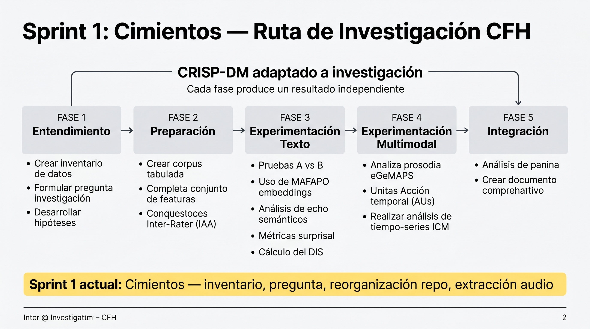

# Sesión de Tutoría #2

## Hermenéutica Forense Computacional — Sprint 1: Cimientos

**Tesista:** Mireya Camacho Celis
**Director técnico:** Julián Zuluaga
**Fecha:** 17 de abril de 2026

---

## 1. Reconocimiento del avance

Antes de hablar de estructura, es importante reconocer lo que se ha logrado en muy poco tiempo. El ritmo de trabajo ha sido excepcional:

**Logros concretos desde la sesión anterior:**

- Implementación completa de la Capa 3 facial con MediaPipe sobre 4 audiencias del Macrocaso 003
- Extracción de 6 Action Units (AU1, AU4, AU6, AU12, AU15, AU17) con datos reales
- Cálculo del Índice de Congruencia Multimodal (ICM) con primeros resultados
- Visualizaciones UMAP y t-SNE del espacio semántico CFH
- Transcripción completa del Corpus C (5 audiencias, 45.9 horas, Whisper)
- Avance en capítulos 4, 5 y 6 del documento de tesis
- Observación exploratoria de patrones diferenciales por subcaso

Esto demuestra una capacidad de ejecución muy alta. El siguiente paso es canalizar esa energía con una estructura que maximice el impacto de cada hora invertida.

---

## 2. Reflexión metodológica

### El valor de la pausa estratégica

En investigación, hay un principio fundamental: **la velocidad de implementación no es igual a la velocidad de descubrimiento**. Podemos producir muchos artefactos (CSVs, visualizaciones, código) pero si no están conectados por un hilo metodológico claro, su valor para la tesis se diluye.

### Observaciones sobre el estado actual

Algunos puntos que vale la pena revisar juntos:

**Sobre el ICM:**

El ICM actual integra el canal verbal (léxico REP) y el canal facial (Action Units), pero el canal vocal (prosodia/eGeMAPS) no se ha ejecutado aún — los valores prosódicos son 0.0 por defecto. Esto significa que el índice, aunque valioso como prototipo, es bimodal (texto + rostro) y no trimodal como lo plantea el framework. Completar el canal vocal con eGeMAPS/OpenSMILE es un paso necesario para que el ICM sea genuinamente multimodal.

**Sobre la dimensión temporal:**

Actualmente, el ICM se calcula como un promedio sobre todos los segmentos de una audiencia. Esto colapsa la dimensión temporal — una expresión facial sostenida durante 30 minutos y un gesto momentáneo de 2 segundos contribuyen igual al promedio.

Sin embargo, la genuinidad de una expresión emocional se manifiesta precisamente en su **persistencia y consistencia temporal**. Un compareciente genuinamente afectado muestra distress facial sostenido; uno que performa muestra flashes aislados. Proponemos enriquecer el análisis con:

- **Prevalencia:** ¿En qué porcentaje de segmentos aparece cada AU?
- **Persistencia:** ¿Cuánto duran los episodios de activación?
- **Autocorrelación:** ¿La señal es estable (genuina) o errática (ruido)?
- **Tendencia temporal:** ¿El ICM aumenta o disminuye durante la audiencia?
- **Ventanas deslizantes:** ICM calculado cada 5 minutos → curva temporal, no un solo número

**Sobre las comparaciones entre audiencias:**

Las comparaciones entre audiencias (4 puntos de datos) deben tratarse con cautela. Cada audiencia tiene condiciones diferentes (magistrado, víctimas presentes, calidad de video, duración). Cualquier patrón observado es una hipótesis exploratoria que requeriría más datos para confirmarse. Esto no le resta valor — las observaciones exploratorias son valiosas si se presentan como tales.

---

## 3. Papers semilla — Hallazgos clave para la tesis

### Paper 1: Sosa/Gutiérrez-Osorio et al. (2025) — JEP + NLP

*"Construyendo la verdad: minería de texto y redes lingüísticas en audiencias del Caso 03 de la JEP"*

Este paper es **el único que aplica NLP directamente a audiencias del Macrocaso 003**. Procesaron 441 videos (vs. nuestros 5) con redes semánticas skipgram y detección de comunidades.

**Hallazgo clave para nosotros:** Las víctimas tienen mayor modularidad narrativa (0.596) que los comparecientes (0.422). Esto sugiere que las víctimas tienen discursos más cohesionados temáticamente, mientras los comparecientes fragmentan su narrativa.

**Implicación:** Nuestro trabajo NO puede ser "más NLP sobre la JEP" — eso ya existe. La contribución debe ser la integración multimodal y el framework de congruencia.

### Paper 2: LegalEye — Baldivas et al. (2025) — Multimodal en español

*"Multimodal Court Deception Detection Across Multiple Languages"*

Arquitectura: fusión tardía de texto + audio + video sobre juicios reales en 3 idiomas.

**Hallazgo clave para nosotros:** En español, el **texto tiene más peso** (81.48% accuracy) que el video (92.86% en inglés pero la fusión total baja en español). La modalidad acústica rinde 73.33% en español.

**Implicación:** No debemos asumir que los AUs faciales son lo más importante para el español colombiano. La Capa 1+2 (texto + semántica) puede ser más informativa que la Capa 3 (facial). Esto refuerza la decisión de consolidar Capa 1+2 antes de profundizar en Capa 3.

### Paper 3: Cann et al. (2025) — Eco semántico

*"Semantic Echo: Measuring Strategic Communication Adoption via Semantic Similarity"*

Método: sentence transformers (`all-MiniLM-L6-v2`) + cosine similarity + ventanas temporales para medir si un discurso "absorbe" el lenguaje de otro actor.

**Hallazgo clave para nosotros:** Esta metodología es directamente aplicable para medir si el discurso de la JEP converge hacia la voz de las víctimas (MAFAPO) a lo largo del tiempo. Supera las limitaciones del enfoque léxico (sinónimos, paráfrasis).

**Implicación:** Integrar el método de eco semántico en nuestra Capa 2 como análisis de convergencia temporal.

---

## 4. Ruta de investigación — Framework CRISP-DM adaptado

<figure class="hero-image">

<figcaption>Ruta de investigación: 5 fases secuenciales. Cada fase produce un resultado defendible independientemente.</figcaption>
</figure>

### Principio clave: cada fase se sostiene sola

Si la Fase 4 (multimodal) no se completa, la tesis ya tiene resultados sólidos con la Fase 3 (texto + semántica). Si la Fase 5 (integración SEM) no converge, los resultados por capa son individualmente publicables.

| Fase | Pregunta | Resultado |
|------|----------|-----------|
| **F1 — Entendimiento** | ¿Qué tenemos y qué podemos medir? | Inventario, pregunta, tabla de features |
| **F2 — Preparación** | ¿Los datos están listos? | Corpus tabulados, features extraídos, IAA |
| **F3 — Texto + Semántica** | ¿Qué dice el texto? | DIS Index validado, eco semántico, surprisal |
| **F4 — Multimodal** | ¿Es genuino lo que dice? | ICM temporal, prosodia, AUs con persistencia |
| **F5 — Integración** | ¿Qué aprendimos? | Path analysis + documento de tesis |

### El patrón de experimentación

Cada experimento sigue una estructura estándar:

```
experiments/EXP-XXX_nombre/
├── notebook.ipynb      ← Código ejecutable
├── config.yaml         ← Parámetros
├── results.json        ← Resultados numéricos
└── FINDINGS.md         ← Pregunta → Método → Resultado → Decisión
```

El `FINDINGS.md` es la pieza clave: cuando llegue el momento de escribir la tesis, solo hay que leer los FINDINGS en orden para tener el esqueleto de resultados y discusión.

---

## 5. Sprint 1: Cimientos — Entregables

Este sprint es de **orden y claridad**, no de código nuevo. Los entregables son:

### E1. Pregunta e hipótesis finales

Propuesta del director:

> *¿En qué medida un framework computacional multimodal permite medir y caracterizar la injusticia discursiva en los archivos judiciales del Macrocaso 003 (JEP), cuantificando la distancia epistémica entre el discurso de la justicia ordinaria y la voz de las víctimas mediante indicadores textuales, prosódicos y de expresión facial?*

**Título propuesto:**

> *Hermenéutica Forense Computacional: un framework multimodal para medir la injusticia discursiva en justicia transicional colombiana*

Puntos pendientes de discusión:
- "Reparación algorítmica" vs "análisis computacional multimodal" — el framework mide, no repara
- "Replicable en otros contextos" — acotar a Colombia/JEP, replicabilidad como trabajo futuro

### E2. Inventario formal de datos

Crear `data/README.md` con el estado real (no planificado) de cada corpus, incluyendo limitaciones y calidad.

### E3. Reorganización del repo

Estructura propuesta:

```
cfh/
├── data/           ← Inventario + datos procesados + features
├── experiments/    ← EXP-XXX con FINDINGS.md cada uno
├── cfh/            ← Paquete Python instalable
├── docs/           ← Capítulos de tesis + estado del arte
├── tutoria/        ← Guías y feedback del director
├── .orbital/       ← Protocolo de gestión de sprints
└── tests/
```

### E4. Extracción de audio

Separar las pistas de audio (.wav) de los 5 videos de audiencias. Prerequisito para eGeMAPS/OpenSMILE.

### E5. Tabla de features completa

| Feature | Modalidad | Corpus | Herramienta | Estado | Referencia |
|---------|-----------|--------|-------------|--------|------------|
| SA — Supresión agentividad | Texto | A+B | spaCy + regex | Implementado | Fraser (1995) |
| NV — Negación victimización | Texto | A+B | spaCy + regex | Implementado | Galtung (1990) |
| REP — Léxico reparación | Texto | A+B | CFH-BERT v2 | F1=0.77 | Zehr (2002) |
| CivDist — Distancia civil | Texto | A+B | Diccionario | Implementado | Van Dijk (2008) |
| Persona gramatical | Texto | A+B | spaCy POS | Pendiente | Hyland (1998) |
| Hedging | Texto | A+B | Dict + dep parsing | Pendiente | Kilicoglu (2008) |
| Léxico emocional | Texto | A+B | NRC + pysentimiento | Pendiente | Mohammad & Turney |
| Surprisal | Texto | A+B | BETO log-probs | Pendiente | Shain et al. (2024) |
| y8 — Distancia MAFAPO | Embedding | A+B | ConfliBERT cosine | Validado p<0.001 | Yang et al. (2023) |
| y9 — Distancia CIDH | Embedding | A+B | ConfliBERT cosine | Validado p<0.001 | Yang et al. (2023) |
| Eco semántico | Embedding | A+B | Sentence-BERT | Pendiente | Cann et al. (2025) |
| eGeMAPS (88 params) | Audio | C | OpenSMILE | Pendiente | Eyben et al. (2016) |
| AU1-AU17 (6 AUs) | Video | C | MediaPipe | Extraído (4 aud.) | Ekman & Friesen |
| Head pose (pitch, yaw) | Video | C | MediaPipe | Parcial | — |
| ICM | Multimodal | C | Custom | Prototipo (sin vocal) | Framework propio |

---

## 6. Lectura obligatoria para este sprint

| # | Paper | Por qué leerlo |
|---|-------|----------------|
| 1 | Gutiérrez-Osorio et al. (2025) — arXiv:2504.04325 | El ÚNICO paper NLP sobre JEP Macrocaso 003. No citarlo sería un vacío |
| 2 | LegalEye — Baldivas et al. (2025) — MDPI Behavioral Sciences | Demuestra viabilidad multimodal en español. En español el texto pesa más que video |
| 3 | Cann et al. (2025) — EPJ Data Science | Método de eco semántico directamente adoptable para medir convergencia |

---

## 7. Lo que NO hacer en este sprint

- No implementar features nuevos
- No correr más experimentos
- No escribir más capítulos de la tesis
- No fine-tunear modelos
- No calcular más ICMs

**Una semana de estructura vale más que tres semanas de código sin rumbo.**

---

## 8. Próxima sesión

En la próxima sesión revisaremos:

1. ¿Se cerró la pregunta de investigación?
2. ¿El inventario de datos refleja la realidad?
3. ¿El repo está reorganizado?
4. ¿Los audios .wav están extraídos?
5. ¿La tabla de features está completa?

Con estos cimientos, en el Sprint 2 podemos empezar la experimentación sistemática (Fase 3) con confianza de que cada resultado será trazable, reproducible y reutilizable para el documento.

---

> *"No buscamos solo qué dice la justicia, sino cómo lo dice, cómo lo expresa, y si lo que expresa es genuino."*

